

  <picture>
    <source media="(max-width: 480px)" srcset="assets/hero-mobile.svg" />
    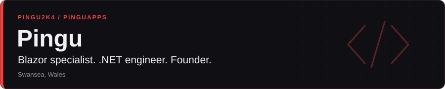
  </picture>

I'm Matthew, better known as **Pingu** — a .NET engineer and founder based in Swansea, Wales.

<table>
  <tr>
    <td width="112" align="center">
      
    </td>
    <td>
      <h3>Blazor is my specialism.</h3>
      
I build Blazor applications, reusable components and tools that make working with Razor easier. My open-source projects tackle the details behind a maintainable Blazor codebase: consistent component markup, build integration, routing and sitemaps.

      
I work across the .NET stack, with Azure for hosting and Aspire for application orchestration and deployment.

    </td>
  </tr>
</table>

## Open source through PinguApps

I'm the **founder and sole owner of [PinguApps](https://github.com/PinguApps)**, where most of my open-source work lives. These projects reflect my work in Blazor and the wider .NET ecosystem.

### Blazor tools

  <a href="https://github.com/PinguApps/RazorStyle">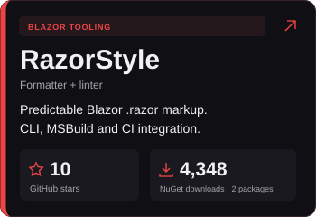</a>
  <a href="https://github.com/PinguApps/BlazorSitemap">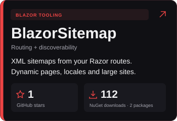</a>

### Components & integrations

Reusable Blazor components and Aspire integrations for hosted services.

  <a href="https://github.com/PinguApps/Aspire.Hosting.Upstash.Redis">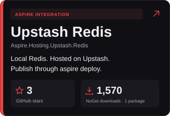</a>
  <a href="https://github.com/PinguApps/Aspire.Hosting.Railway">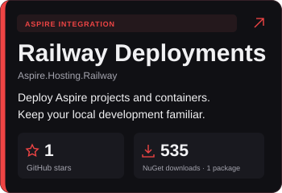</a>

  <a href="https://github.com/PinguApps/Aspire.Hosting.Bunny.Storage">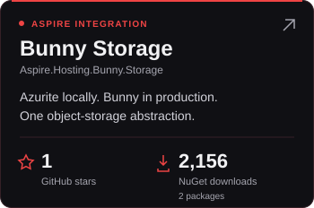</a>
  <a href="https://github.com/PinguApps/Blazor.QRCode">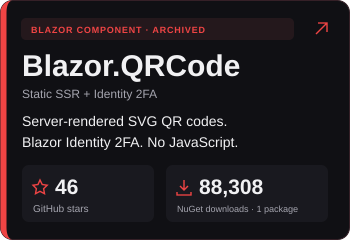</a>

**Blazor.QRCode** renders SVG QR codes on the server, including static SSR and prerendering. It fits the built-in Blazor Identity authenticator setup pages without JavaScript. The repository is **archived**.

Updated daily. NuGet totals combine the packages published from each repo.

NuGet packages behind the cards

- **RazorStyle:** [build integration](https://www.nuget.org/packages/PinguApps.RazorStyle/) and [CLI](https://www.nuget.org/packages/PinguApps.RazorStyle.Cli/).
- **BlazorSitemap:** [library](https://www.nuget.org/packages/PinguApps.BlazorSitemap/) and [abstractions](https://www.nuget.org/packages/PinguApps.BlazorSitemap.Abstractions/).
- **Upstash Redis:** [hosting integration](https://www.nuget.org/packages/PinguApps.Aspire.Hosting.Upstash.Redis/).
- **Railway:** [hosting integration](https://www.nuget.org/packages/PinguApps.Aspire.Hosting.Railway/).
- **Bunny Storage:** [hosting integration](https://www.nuget.org/packages/PinguApps.Aspire.Hosting.Bunny.Storage/) and [runtime library](https://www.nuget.org/packages/PinguApps.Bunny.Storage/).
- **Blazor.QRCode:** [Blazor component](https://www.nuget.org/packages/PinguApps.Blazor.QRCode/).

## AI-native development

AI is central to my day-to-day engineering. I use **Codex, Claude and T3 Code** heavily to explore designs, implement scoped changes and review work. I define the architecture and constraints, give agents clear context, inspect the diffs and verify behaviour with tests and CI. I own the code that ships.

  
  
  <a href="https://t3.codes/">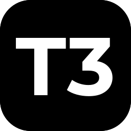</a>

## My stack

**.NET & application development**

  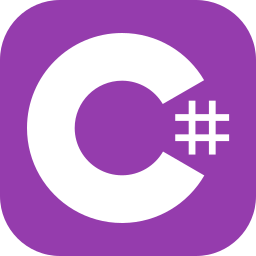
  
  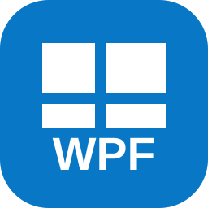
  
  
  
  
  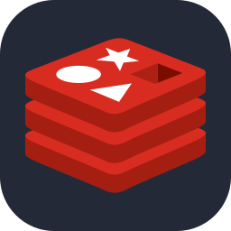

**Build, automation & hosting**

  
  
  
  
  
  
  
  

**Development tools**

  
  
  
  

## GitHub activity

Activity across my profile and PinguApps, including private GitHub contributions. Work hosted on Azure DevOps isn't included.

  <picture>
    <source media="(max-width: 520px)" srcset="assets/cards/combined-weekly-mobile.svg" />
    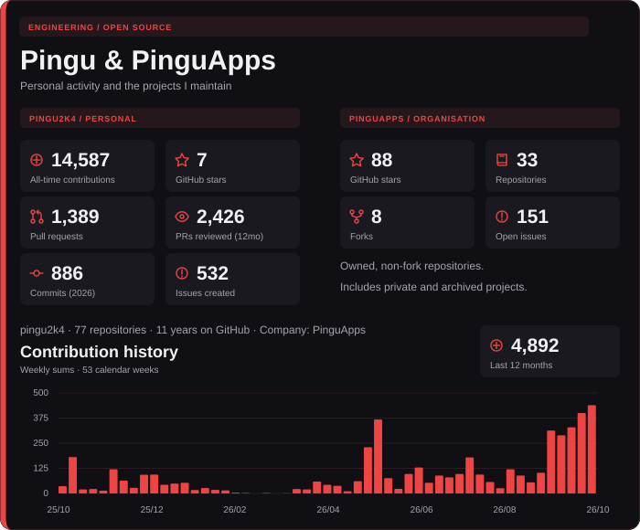
  </picture>

  <picture>
    <source media="(max-width: 520px)" srcset="assets/cards/adoption-mobile.svg" />
    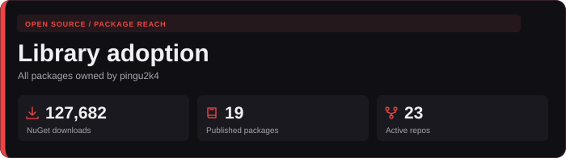
  </picture>

  <picture>
    <source media="(max-width: 520px)" srcset="assets/cards/highlights-mobile.svg" />
    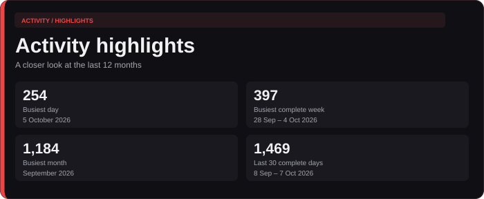
  </picture>

Calendar updated: 9 October 2026. Account, repository and package statistics refresh daily.

## Get in touch

Happy to talk about **Blazor, .NET, Azure or the projects above**.

[Email](mailto:contact@pinguapps.com) · [LinkedIn](https://www.linkedin.com/in/pingu2k4/) · [X](https://x.com/pingu2k4)

<!-- Card sources and icon attribution: ASSET-SOURCES.md. SVGs update through .github/workflows/profile-cards.yml. -->
