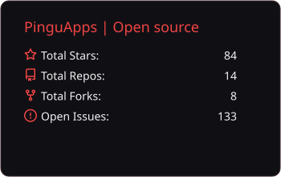
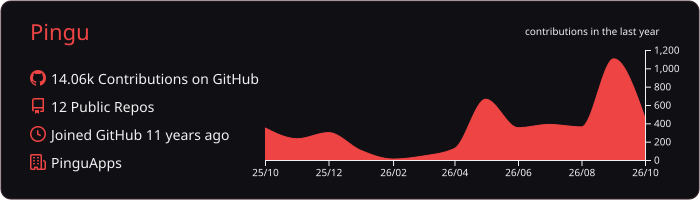

  <picture>
    <source media="(max-width: 480px)" srcset="assets/hero-mobile.svg" />
    
  </picture>

I'm Matthew, better known as **Pingu** — a .NET engineer and founder based in Swansea, Wales.

<table>
  <tr>
    <td width="112" align="center">
      
    </td>
    <td>
      <h3>Blazor is my specialism.</h3>
      
I build Blazor applications, reusable components and tools that make working with Razor easier. My open-source projects tackle the details behind a maintainable Blazor codebase: consistent component markup, build integration, routing and sitemaps.

      
I work across the .NET stack, with Azure for hosting and Aspire for application orchestration and deployment.

    </td>
  </tr>
</table>

## Open source through PinguApps

I'm the **founder and sole owner of [PinguApps](https://github.com/PinguApps)**, where most of my open-source work lives. These are some of the projects I build and maintain.

### [RazorStyle](https://github.com/PinguApps/RazorStyle)

A formatter and linter built specifically for Blazor `.razor` files. It keeps component markup and attribute ordering consistent, with a .NET CLI and MSBuild integration for local development and CI.

### [BlazorSitemap](https://github.com/PinguApps/BlazorSitemap)

Sitemaps generated from your existing Razor routes. Supports dynamic, database-backed pages, localisation, modification dates and large sitemaps in server-hosted Blazor applications.

### Aspire integrations

I also build integrations that keep local Aspire development familiar while connecting applications to hosted services.

- **[Aspire.Hosting.Upstash.Redis](https://github.com/PinguApps/Aspire.Hosting.Upstash.Redis)** — deploy standard Aspire Redis resources to Upstash.
- **[Aspire.Hosting.Railway](https://github.com/PinguApps/Aspire.Hosting.Railway)** — deploy Aspire projects and containers to Railway.
- **[Aspire.Hosting.Bunny.Storage](https://github.com/PinguApps/Aspire.Hosting.Bunny.Storage)** — use Azurite locally and Bunny Storage in production, with a shared object-storage abstraction.

## My stack

**.NET & application development**

  
  
  
  
  
  
  
  

**Build, automation & hosting**

  
  
  
  
  
  
  
  

**Development tools**

  
  
  
  

## GitHub activity

My public activity spans this profile and PinguApps. Much of my professional work is in private repositories or Azure DevOps, so these cards show only part of what I build.

  
  

  

## Get in touch

Happy to talk about **Blazor, .NET, Azure or the projects above**.

[Email](mailto:contact@pinguapps.com) · [LinkedIn](https://www.linkedin.com/in/pingu2k4/) · [X](https://x.com/pingu2k4) · [Stack Overflow](https://stackoverflow.com/users/1677045) · [CV](https://pinguapps.blob.core.windows.net/personal/Matthew%20Parker.pdf)

<!-- Card sources and icon attribution: ASSET-SOURCES.md. SVGs update through .github/workflows/profile-cards.yml. -->
